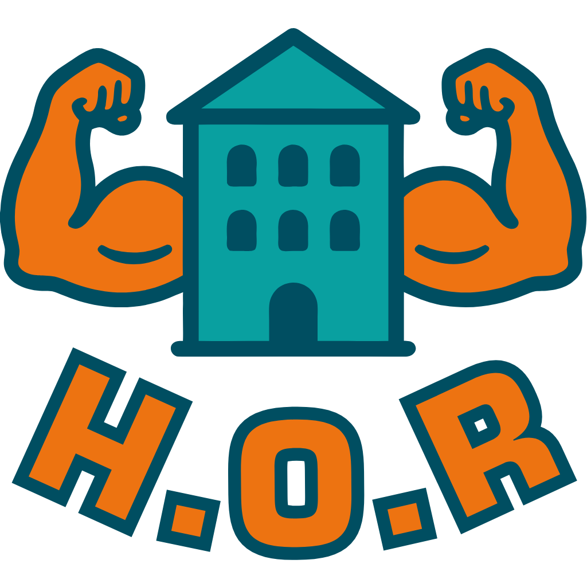

# Hostelworld On Roids

## Introduction

Hostelworld on Roids (H.O.R) is an open source browser extension designed to enhance your experience
while searching and selecting hostels.

It eliminates obstructions from featured/promoted properties and unlocks hidden native features on Hostelworld. Moreover,
it lists some properties which may be unavailable due to scheduling conflicts, but would have been more ideal for you if
your travel dates were more flexible.

In a nutshell, the extension provides extra metrics by analyzing the availability and reviews per property, presenting
this data directly on the property card. This might help to facilitate your decision-making process when selecting a
hostel.

Here's what it does:

* Removes featured/promoted property statue obstructions from search results.
* Loads all properties on a single page — no more paginating through results.
* Surfaces mobile-exclusive deals that are normally reserved only for the mobile app.
* Displays guest-origin stats per property, showing where upcoming guests are arriving from.
* Shows the gender split (male, female, solo travelers) and age group distribution of past guests.
* Checks room availability by type (mixed dorms, female-only dorms, private rooms) and their capacity.
* Assigns demographic badges like "Great for Solo", "Female Friendly", "Young Crowd", and more.
* Offers a custom filter system to narrow down properties by badge, demographics, and age groups.

H.O.R was developed as a personal side project to simplify the process of selecting the "best" hostel from an extensive
range of good ones. It proved & continues to prove useful during my travels, assisting me in finding the most suitable
place to stay depending on my mood, whether I was looking for some busy or quieter place to stay at. :)

## Support

If you find this extension useful, consider buying me a coffee! It helps keep the project alive and motivates
further development.

## Installation

Install the extension directly from the [Chrome Web Store](https://chrome.google.com/webstore/detail/dfilmjjmeegkakfmnadkimgflocnnnbg).

## Supported platforms

Currently, the extension is developed to run on **Chrome version 88** and newer versions. While it is likely to function
on other browsers, it has not been officially tested and confirmed yet.

This section will be updated when additional browsers are supported.

## Development & Building

Apart from the obvious [git](https://git-scm.com/) one :), you'll need [node.js](https://nodejs.org) and
[yarn](https://yarnpkg.com/getting-started/install/) (utilize corepack magic, so you don't have to install that one).

The required versions of nodejs & yarn needed can be found at the [engines section](/package.json#L4-L6) of the
`package.json`.

Simply:
* Use `git` to clone the project.
* Navigate to project's root folder.
* Run `corepack enable` in that folder.
* Run `yarn` in that folder.
* Once completed, run `yarn watch` to build it.

Once build, head over to your Chrome browser and:
* Navigate to `Menu → More tools → Extensions` and enable `Developer Mode`.
* Click on `Load unpacked extension` and select the `/dist` folder.

Congratulations, the extension should now be installed in your browser! Please note that in some cases, you may need to
`reload` the extension for the changes to take effect.

Additional `build` & `lint` commands can be found at the [scripts section](/package.json#L9-L24) of the `package.json`.

## Packaging & Deployment

### Environment Setup

**Note:** _This setup is optional and only required for extension packaging and shipping. It's unnecessary for local development._

For packaging and deployment functionality, you'll need to set up environment variables. Simply:
* Copy `.env.example` to `.env` in the project root.
* Fill in the actual values for your specific setup.

### Available Commands

Once environment is configured, you can use these packaging and deployment commands:
* `yarn package:zip` - Creates a ZIP package for manual installation or Web Store upload.
* `yarn package:crx` - Creates a signed CRX package for direct installation.
* `yarn extension:upload` - Uploads the latest version to Chrome Web Store.
* `yarn extension:publish` - Submits the current version for review and publication.
* `yarn extension:deploy` - Uploads and publishes the latest version in one go.

## Contributing

Contributions are more than welcome! Feel free to open a PR to introduce new features or fix any existing issues.

Please adhere to the software practices & principles to the best of your knowledge, try to align with the coding
style of the project to minimize cognitive load for reviewers/readers, and don't forget to run `yarn lint` before
opening a PR. :)

___
_Disclaimer: Hostelworld On Roids is developed independently and is not officially endorsed by or affiliated with
Hostelworld._
